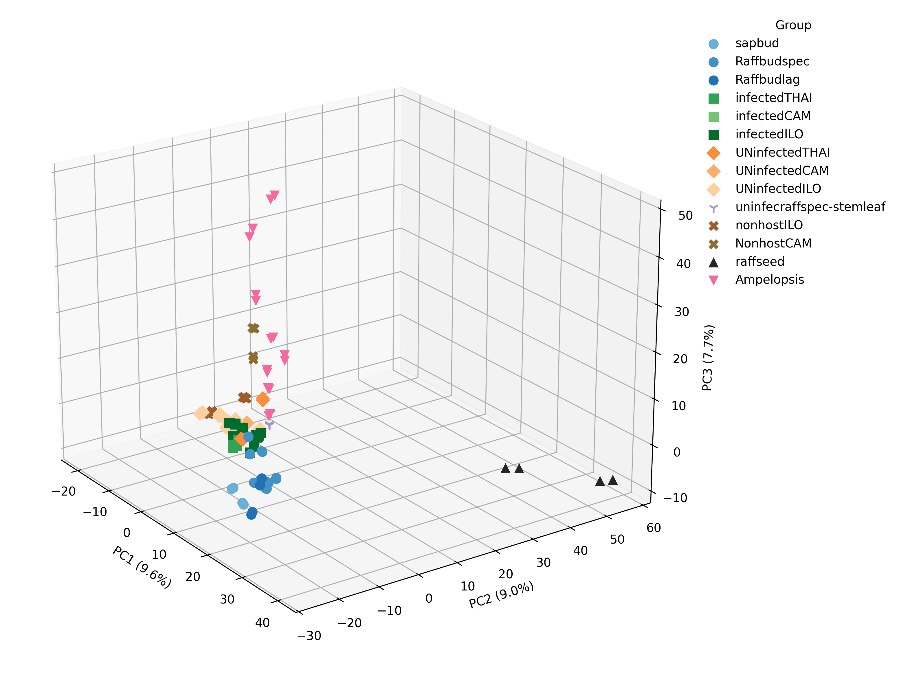

# Figure 1 - PCA

#

Principal component analysis (PCA) of metabolite profiles across Rafflesia, Tetrastigma, and Ampelopsis sample groups. The 3D PCA plot displays the first three principal components, which together explain 26.3% of the cumulative variance (PC1: 9.6%, PC2: 9.0%, PC3: 7.7%). Each point represents an LC-MS technical run, with two runs per biological sample, colored by sample group and shaped by biological role: circles for Rafflesiaceae buds, squares for infected hosts, diamonds for uninfected hosts, Xs for non-hosts, triangles for Rafflesia seeds (black), and inverted triangles for Ampelopsis. The PCA shows broad chemical differentiation among parasitic tissues, host tissues, non-host species, and Ampelopsis, with partial overlap among several vine tissue groups. 