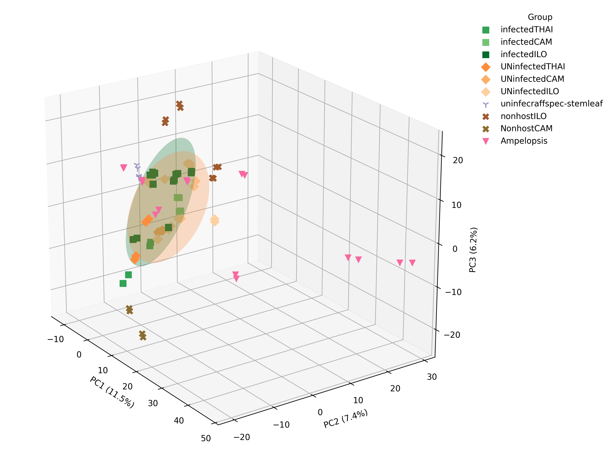

# Figure 2 - PCA

#

Principal component analysis (PCA) of metabolite profiles across infected, uninfected, and non-host Tetrastigma species, as well as Ampelopsis with Rafflesiaceae sample groups removed. 3D PCA plot shows the first three principal components, which together explain 25.1% of cumulative variance (PC1: 11.5%, PC2: 7.4%, PC3: 6.2%). Each point represents one LC-MS run, with two technical runs per biological sample. Groups are distinguished by color and marker shape. Ellipsoids represent approximate 68% covariance regions for groups with sufficient replication (based on Mahalanobis distance in PC1-PC3 space) and were pooled across localities rather than fit separately per site. Infected hosts (squares, Tetrastigma pooled across Thailand, Camarines Norte, and Iloilo) are enclosed within a single green ellipsoid, while uninfected hosts (diamonds, pooled across the same three localities) are enclosed within a single orange ellipsoid; non-host Tetrastigma (cross marks) are shown without an ellipsoid given smaller per-locality sample sizes. The two ellipsoids overlap partially, consistent with chemical divergence between infected and uninfected hosts. Uninfected juvenile shoots and leaves of Rafflesia speciosa’s host (lilac tripod/Y-markers) are visually separated from the infected host roots (infectedILO, dark green squares). Non-host Tetrastigma species (nonhostILO and NonhostCAM, cross marks) are visually separated from infected species (infectedILO and infectedCAM) within the same locality (CAM, ILO). Ampelopsis is represented with pink triangle markers. This visualization illustrates chemical differences among host-compatibility groups.