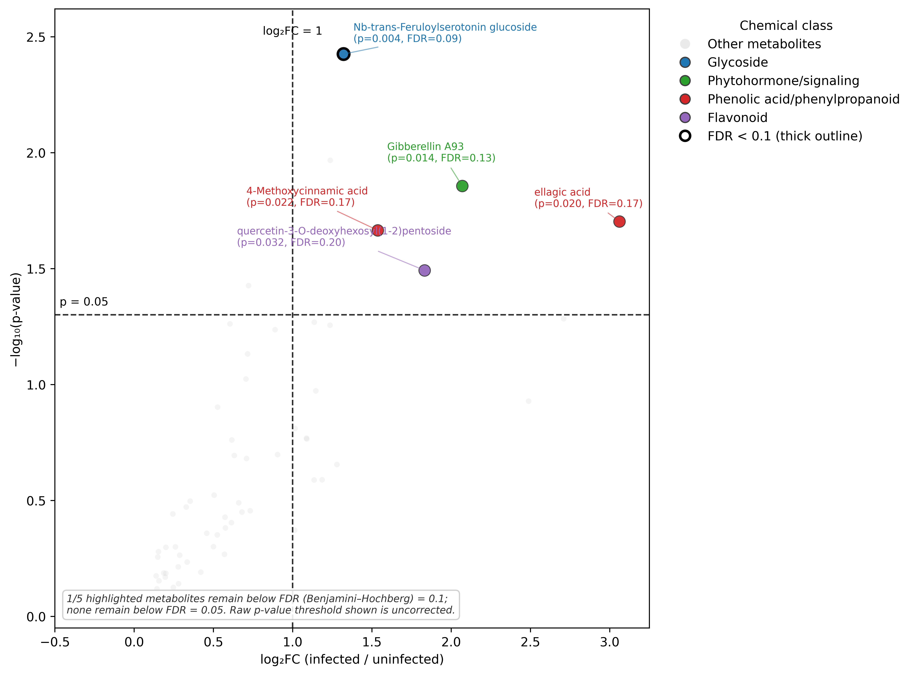

# Figure 4 - PCA Enriched Scatter

#

Differential abundance of natural metabolites in infected versus uninfected Tetrastigma hosts. Significance scatterplot showing metabolite enrichment in infected Tetrastigma tissues relative to uninfected tissues pooled across Thailand/THAI, Camarines Norte/CAM, and Iloilo/ILO. The x-axis represents log₂ fold change (infected/uninfected), and the y-axis shows −log₁₀(p-value) from two-sided Welch's t-tests. Metabolites were filtered to retain natural, non-questionable annotations prior to analysis. Labels report both the raw p-value and the Benjamini–Hochberg FDR-adjusted q-value for each highlighted metabolite; a heavier point outline indicates FDR < 0.10. Five highlighted natural-product annotations showed nominal infection-associated enrichment under the uncorrected p-value threshold, but none remained significant after Benjamini–Hochberg correction at FDR < 0.05. Dashed lines indicate the uncorrected fold-change threshold (log₂FC = 1) and significance threshold (p = 0.05). To improve visualization, metabolites with log₂FC < −0.5 were omitted from the plot. None of the labeled metabolites remained significant after FDR correction (q < 0.05); these should therefore be interpreted as nominal, exploratory candidate markers rather than statistically confirmed markers of Rafflesiaceae-infected host tissues.