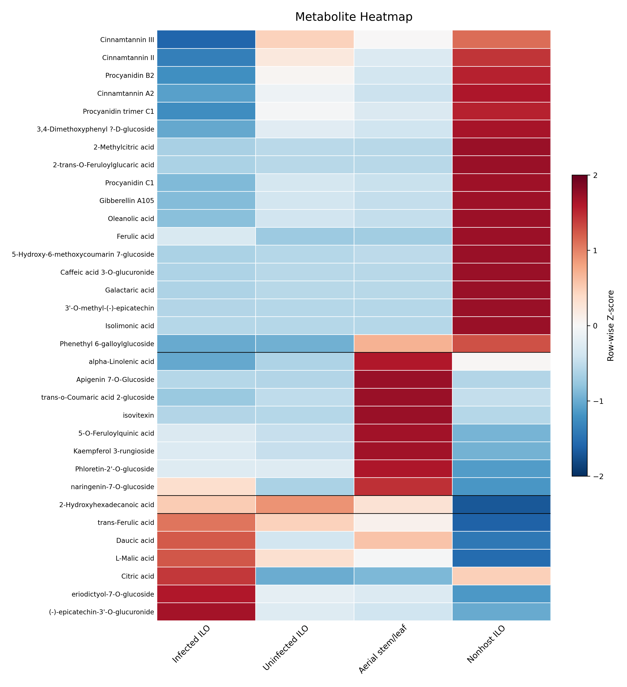

# Figure 7 - Metabolite Heatmap

#

Heatmap showing the relative abundance of selected natural metabolites across infected host roots (Infected ILO), uninfected host roots (Uninfected ILO), uninfected aerial stem/leaf tissues, and non-host roots (Non-host ILO) in the Rafflesia speciosa-Tetrastigma system. Metabolites were selected from the untargeted LC-MS dataset based on their ecological relevance and confidence of annotation, and values were standardized using row-wise Z-score normalization to facilitate comparisons among tissue types. Positive Z-scores (orange-red) indicate relative enrichment, whereas negative Z-scores (blue) indicate relative depletion relative to the mean abundance of each metabolite across tissues. 