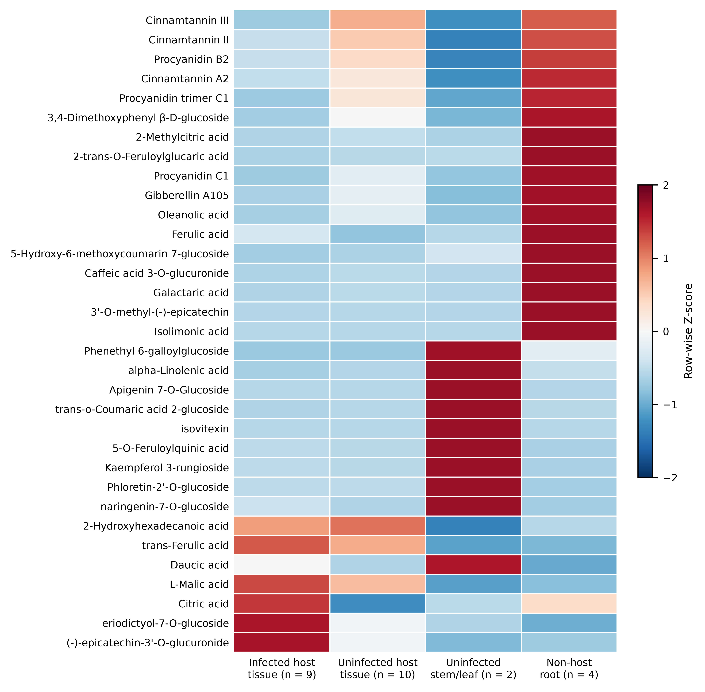

# Figure 7: Heatmap showing the relative abundance of selected natural metabolites across infected host tissues, uninfected host tissues, uninfected aerial stem/leaf tissues and non-host roots.

> *Figure description to be added after publication.*